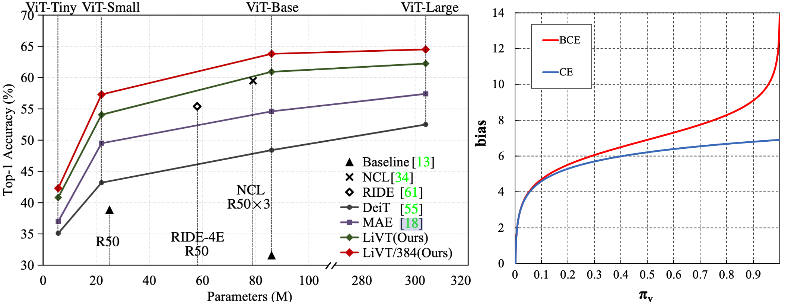
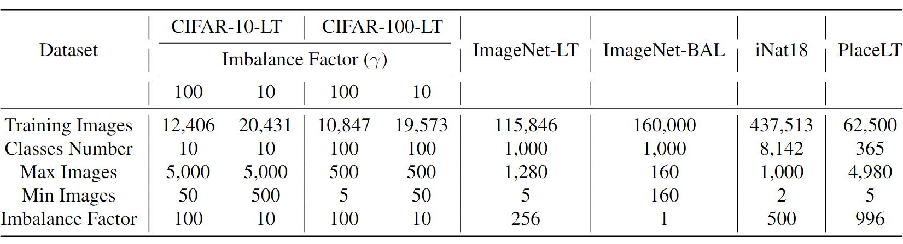
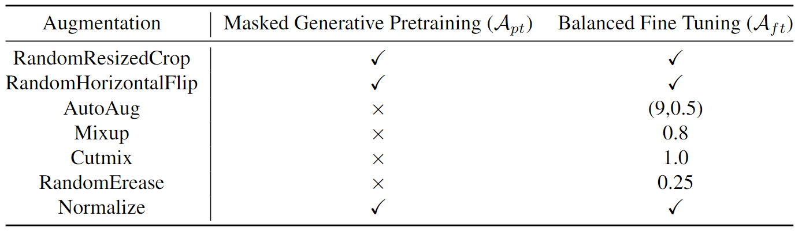
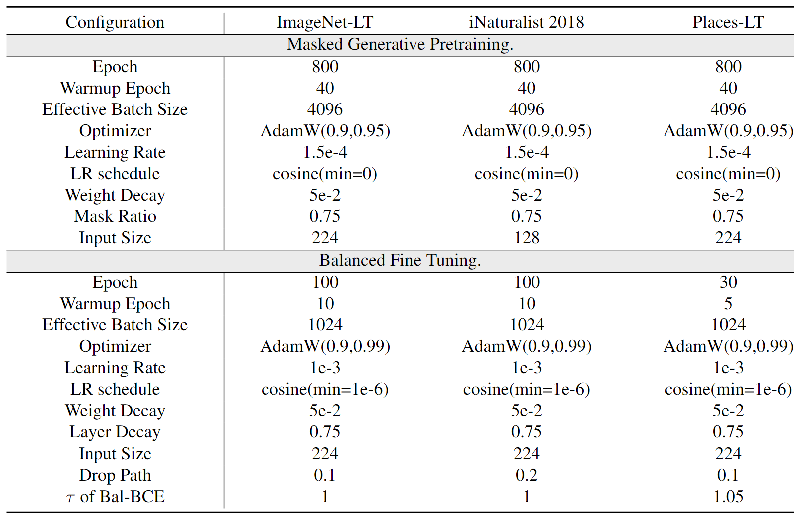

# Learning Imbalanced Data with Vision Transformers

Zhengzhuo Xu, Ruikang Liu, Shuo Yang, Zenghao Chai and Chun Yuan

This repository is the official PyTorch implementation of the paper [LiVT](https://arxiv.org/abs/2212.02015) in CVPR 2023.
&nbsp;
<p align="center">

</p>
&nbsp;

## Environments

```shell
python == 3.7
pytorch >= 1.7.0
torchvision >= 0.8.1
timm == 0.3.2
tensorboardX >= 2.1
```
1. We recommand to install `PyTorch 1.7.0+`, `torchvision 0.8.1+` and `pytorch-image-models 0.3.2`.
2. If your PyTorch is 1.8.1+, a [fix](https://github.com/huggingface/pytorch-image-models/issues/420) is needed to work with timm.
3. See `requirements.txt` for detailed requirements. You don't have to be in strict agreement with it, just for reference.

## Data preparation

We adopt `torchvision.datasets.ImageFolder` to build our dataloaders. Hence, we resort all datasets (ImageNet-LT, iNat18, Places-LT, CIFAR) as follows:

```shell
/path/to/ImageNet-LT/
    train/
        class1/
            img1.jpeg
        class2/
            img2.jpeg
    val/
        class1/
            img3.jpeg
        class2/
            img4.jpeg
```
You can follow the `prepare.py` to construct your dataset.

The detailed information of these datasets are shown as follows:
&nbsp;
<p align="center">

</p>
&nbsp;

## Usage

1. Please set the **DATA_PATH** and **WORK_PATH** in `util.trainer.py` Line 6-7.

2. Typically, make sure 4 or 8 GPUs and >12GB per GPU Memory are available.

3. Keep the settings consistent with the follows.

&nbsp;
<p align="center">

</p>
&nbsp;
<p align="center">

</p>
&nbsp;


You can see all args in Class `Trainer` in `util/trainer.py`. 

Specially, for different stage, the commands are:

```python
# MGP stage
python script/pretrain.py
# BFT stage
python script/finetune.py
# evaluate stage
python script/evaluate.py
```
## Results and Models

Balanced Finetuned Models and Masked Generative Pretrained Models.

<table class="tg">
<thead>
  <tr>
    <th class="tg-nrix">Dataset</th>
    <th class="tg-nrix">Resolution</th>
    <th class="tg-nrix">Many</th>
    <th class="tg-nrix">Med.</th>
    <th class="tg-nrix">Few</th>
    <th class="tg-nrix">Acc</th>
    <th class="tg-nrix">args</th>
    <th class="tg-nrix">log</th>
    <th class="tg-nrix">ckpt</th>
    <th class="tg-nrix">MGP ckpt</th>
  </tr>
</thead>
<tbody> 
  <tr>
    <td class="tg-57iy">ImageNet-LT</td>
    <td class="tg-57iy">224*224</td>
    <td class="tg-57iy">73.6</td>
    <td class="tg-57iy">56.4</td>
    <td class="tg-57iy">41.0</td>
    <td class="tg-57iy">60.9</td>
    <td class="tg-57iy"><a href="https://drive.google.com/file/d/1v-aofP9XohtlVhqV-OZT_V6KOOx486Rd/view?usp=share_link">download</a></td>
    <td class="tg-57iy"><span style="color:#000"><a href="https://drive.google.com/file/d/1ZOnx67skoH7vBEgKWhPzM8RSBcbz-GtX/view?usp=share_link">download</a></td>
    <td class="tg-57iy"><span style="color:#000"><a href="https://drive.google.com/file/d/1em86e9VHlfZy9aWgJqy6-H2primsNJKW/view?usp=share_link">download</a></td>
    <td class="tg-57iy" rowspan="2"><a href="https://drive.google.com/file/d/1vAbWTZWEofOvdvun2sfAH7K9aBbnG0Co/view?usp=share_link">Res_224</a></td>
  </tr>
  <tr>
    <td class="tg-nrix">ImageNet-LT</td>
    <td class="tg-nrix">384*384</td>
    <td class="tg-nrix">76.4</td>
    <td class="tg-nrix">59.7</td>
    <td class="tg-nrix">42.7</td>
    <td class="tg-nrix">63.8</td>
    <td class="tg-nrix"><span style="color:#000"><a href="https://drive.google.com/file/d/1sTZYVXJDnGHyyKOhoYRzKoqRK6EyHrkp/view?usp=share_link">download</a></span></td>
    <td class="tg-nrix"><span style="color:#000"><a href="https://drive.google.com/file/d/1Zm3Han6_6KVQFdh2Ftr0qHqcC-EbrIGp/view?usp=share_link">download</a></span></td>
    <td class="tg-nrix"><span style="color:#000"><a href="https://drive.google.com/file/d/1lOoOvJtBycij7wqqP47vzQFHWX0_Q7II/view?usp=share_link">download</a></span></td>
  </tr>
  <tr>
    <td class="tg-57iy">iNat18</td>
    <td class="tg-57iy">224*224</td>
    <td class="tg-57iy">78.9</td>
    <td class="tg-57iy">76.5</td>
    <td class="tg-57iy">74.8</td>
    <td class="tg-57iy">76.1</td>
    <td class="tg-57iy"><a href="https://drive.google.com/file/d/1fSb0HH1qlfEbfnWEehdrbIWZjI8MHJGY/view?usp=share_link">download</a></td>
    <td class="tg-57iy"><span style="color:#000"><a href="https://drive.google.com/file/d/1TMMKKRvLJzlV-AeA1pKHDQV3nVLJI5W1/view?usp=share_link">download</a></span></td>
    <td class="tg-57iy"><span style="color:#000"><a href="https://drive.google.com/file/d/1ArJfsdVMrl8wU2FTgD-5X8KyQnQRC16X/view?usp=share_link">download</a></span></td>
    <td class="tg-57iy" rowspan="2"><a href="https://drive.google.com/file/d/1iKJRd_k08ye2sHteAi55ZFG8tFk-1YdB/view?usp=share_link">Res_128</a></td>
  </tr>
  <tr>
    <td class="tg-nrix">iNat18</td>
    <td class="tg-nrix">384*384</td>
    <td class="tg-nrix">83.2</td>
    <td class="tg-nrix">81.5</td>
    <td class="tg-nrix">79.7</td>
    <td class="tg-nrix">81.0</td>
    <td class="tg-nrix"><span style="color:#000"><a href="https://drive.google.com/file/d/1dSdO2ImAMBUiwsCSi9XlyKQ7H3Ee93Zq/view?usp=share_link">download</a></span></td>
    <td class="tg-nrix"><span style="color:#000"><a href="https://drive.google.com/file/d/19xxTmlnaxrkXCTQoWFDCuN4RsLE8bE6f/view?usp=share_link">download</a></span></td>
    <td class="tg-nrix"><span style="color:#000"><a href="https://drive.google.com/file/d/1dpVbiK1ajmLdvt9Xmo7xOCGdIe56_QZE/view?usp=share_link">download</a></span></td>
  </tr>
</tbody>
</table>


## Citation
If you find our idea or code inspiring, please cite our paper:
```bibtex
@inproceedings{LiVT,
  title={Learning Imbalanced Data with Vision Transformers},
  author={Xu, Zhengzhuo and Liu, Ruikang and Yang, Shuo and Chai, Zenghao and Yuan, Chun},
  booktitle={IEEE Conference on Computer Vision and Pattern Recognition (CVPR)},
  year={2023}
}
```
This code is partially based on [Prior-LT](https://github.com/XuZhengzhuo/Prior-LT), if you use our code, please also cite：
```bibtex
@inproceedings{PriorLT,
  title={Towards Calibrated Model for Long-Tailed Visual Recognition from Prior Perspective},
  author={Xu, Zhengzhuo and Chai, Zenghao and Yuan, Chun},
  booktitle={Thirty-Fifth Conference on Neural Information Processing Systems},
  year={2021}
}
```

## Acknowledgements
This project is highly based on [DeiT](https://github.com/facebookresearch/deit) and [MAE](https://github.com/facebookresearch/mae).

The CIFAR code is based on [LDAM](https://github.com/kaidic/LDAM-DRW) and [Prior-LT](https://github.com/XuZhengzhuo/Prior-LT).

The loss implementations are based on [CB](https://github.com/vandit15/Class-balanced-loss-pytorch), [LDAM](https://github.com/kaidic/LDAM-DRW), [LADE](https://github.com/hyperconnect/LADE), [PriorLT](https://github.com/XuZhengzhuo/Prior-LT) and [MiSLAS](https://github.com/dvlab-research/MiSLAS).